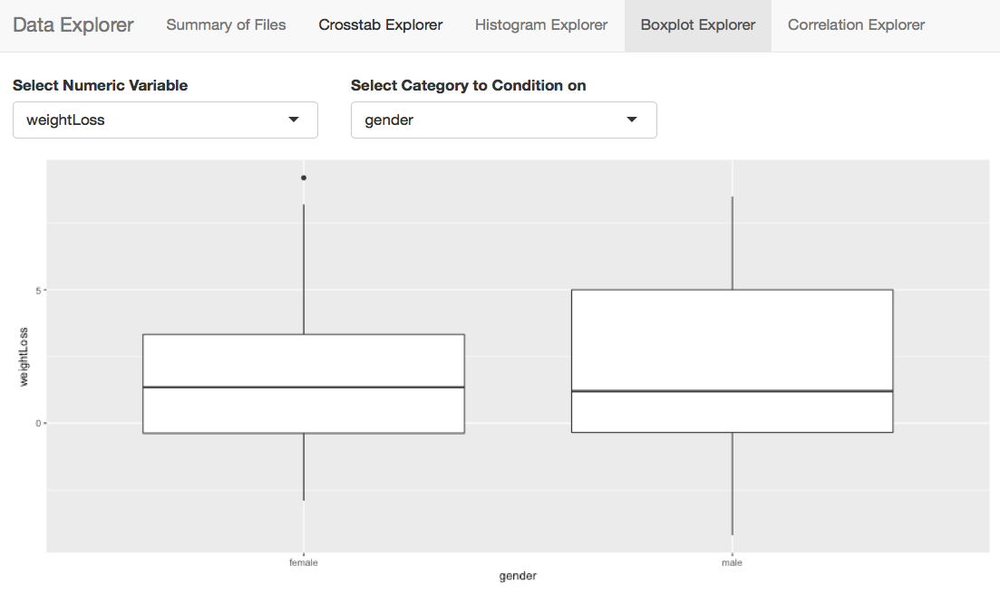
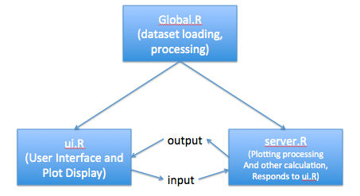

```{r setup, include=FALSE}
knitr::opts_chunk$set(echo = TRUE)
```

## Needed R Packages

You will need R and Rstudio to run this workshop.

You will need the following packages to do this workshop. Please install these packages using the `install.packages()` command.

```{r message=FALSE}
library(tidyverse)
library(shiny)
```

## Introduction

Cribbed from my twitter bio:

- Bioinformatics Developer, Instructor, and Postdoctoral Researcher at OHSU 
- Collaborative Informaticist and R/Data Science evangelist 
- Cascadia-R co-organizer
- Plays well with others

## Overview

+ Who's Afraid of Data?
+ Exploratory Data Analysis Review
+ Using `shiny`/`dplyr` to teach EDA
+ Quick Workshop!
+ Other Applications

## Who's Afraid of Data?

+ Everyone (except you guys)
+ Our basic science students

## What's the Problem?

+ Assumptions Not Met
+ Statistical Procedures Badly Applied
+ Bad Analysis, Bad Publications, Bad Science!

## The Approach

Gradual exposure can lessen fear...

+ Provide a synthetic dataset that is a puzzle
+ Provide a research question
+ Use `shiny` dashboards to ask key questions of data (EDA)
+ Clean Data using `dplyr`
+ Iterate EDA and cleaning
+ Answer the question

## What is Exploratory Data Analysis (EDA)?

- Pioneered by Tukey
- Detective work on your data
- An attitude towards data, not just techniques
- 'Find patterns, reveal structure, and make tenative model assessments (Behrens)'
- Visualization and exploratory techniques
- Missing skill with most data scientists!

## Remember

"Exploratory data analysis can never be the whole story, but nothing else can serve as the foundation stone."
- John Tukey, *Exploratory Data Analysis*

## EDA is not cheating!

In contrast to *Confirmatory Data Analysis (CDA)*, such as hypothesis testing, the goals of EDA are to:

- Explore qualities of the dataset
- Assess whether assumptions are met for statistical models
- Filter and clean data if necessary
- Transform data into more usable format
- Make data ready for CDA

EDA is vital when repurposing and reusing data that was collected for another purpose. Don't go in blind!

## EDA: Always read the data dictionary!

Always read the data dictionary if provided! There is often some useful information in there about how the data is represented (such as the units for each column, etc).


## Some of the EDA tools built into R

- `summary()` - Look for 'strange' values
- `table()` - Look for confounding among categorical variables
- `hist()` - Highlight outliers
- `boxplot()` - Compare conditional medians and distributions
- `plot.xy()` - Look for correlations among continuous variables

## Wrap them up in a Shiny wrapper

- Lower the mental effort to ask questions
- Everything works on the data types (categorical vs. numeric) in a `data.frame`
- Each tab lets you ask particular questions of data



## Provide the tools to clean up the data

Three commands:

- `filter()` - remove rows according to criteria
- `select()` - select columns by name
- `mutate()` - calculate new column variables by manipulating data

## dplyr::filter()

`filter()` lets you select rows according to a criteria. You can use `|` (OR) and `&` (AND) to chain together logical statements.

```{r message=FALSE}
library(dplyr)
newIris <- iris %>% filter(Species == "setosa" & Sepal.Length > 5)

head(newIris)
```

Note that any statement or function that produces a boolean vector (such as `is.na(Species)`) can be used here.

## dplyr::select()

`select()` lets you select columns in your dataset. 

Remember: "`filter()` works on rows, `select()` works on columns." - Chester's Mantra

```{r}
library(dplyr)
newIris <- iris %>% select(Sepal.Width, Species)

head(newIris)
```

## dplyr::mutate()

`mutate()` is one of the most useful `dplyr` commands. You can use it to transform data and add it as a new column into the data.frame:

```{r}
library(dplyr)
newIris <- iris %>% mutate(sepalSum = Sepal.Length + Sepal.Width)

head(newIris)

#add a column with the same value for each entry
newIris <- newIris %>% mutate(value = "Site1")

head(newIris)
```

## Chaining dplyr commands using `%>%`

The power of dplyr comes from the fact that you can chain multiple steps.

Example: Let's calculate a new column `SepalMean` on `iris` and filter the dataset on this new variable.

```{r}
library(dplyr)
data(iris)

iris2 <- iris %>% mutate(SepalMean = (Sepal.Length + Sepal.Width) / 2) %>%
  filter(SepalMean > 4)

nrow(iris)
nrow(iris2)

head(iris2)
```

##Using the EDA Shiny App

For the workshop, you'll use the Shiny App to do some EDA. You will need to be familiar with the basic architecture of the app.

- `global.R` - This is where you'll do your work - place filtering and processing steps here. Any objects loaded here can be seen by both the `ui.R` and `server.R`.



##The Problem

An experimental weight loss drug was first tested at one site with volunteers (DatasetA). Given the small sample size, volunteers from an additional site were recruited (DatasetB). 

1) Your goal is to conduct EDA on the two separate datasets to assess whether there was an effect from the weight loss drug. If you notice any issues in the data, will you need to filter or transform the data?
2) Given your EDA of both datasets, can you combine the datasets into a single dataset for analysis? What will you need to do to compare them?

Go as far as you can. Remember to use your post-its to show your status and whether you need help.

##Go For It!

EDA is a puzzle with real-world consequences. Use your tools to understand the data!

Get the workshop materials here:

```{r eval=FALSE}
git clone http://github.com/laderast/shinyEDA
```

in the `shinyEDA/` folder, open up the `.Rproj` file

Datasets are in the `data/` folder along with the data dictionaries and readmes. 

Read `weightLossAssignment.pdf` for more details.

## Discussion and Walkthrough

+ Issues with Dataset A?
+ Issues with Dataset B?

For each issue with the data: 

+ What was the issue?
+ What did you decide to do about it?
+ What was the impact of your action (ex: did it change your n?)?

## Load your own data

You can load your own datasets for exploration and cleaning - just assign them the name `dataset`. 

The dashboard tries to detect what are numeric variables (`numeric`) and what are categorical variables (`ordered`, `factor`). So you may need to set the type for each of the variables.

## More uses of the EDA Shiny App

Cardiovascular Risk Prediction Workshop: 

https://github.com/laderast/cvdNight1

Many more workshops in the future!

## Acknowledgements

This work was funded by a Big Data to Knowledge (BD2K) T25 Grant: 1R25EB020379-01

## Suggestions? Comments?

+ email: tedladeras@gmail.com
+ web: [laderast.github.io](http://laderast.github.io)
+ twitter: @tladeras

## Happy to Talk about the Shiny App

Feel free to fork this the shiny app for your own purposes. It's designed to be a simple introduction to Shiny as well.